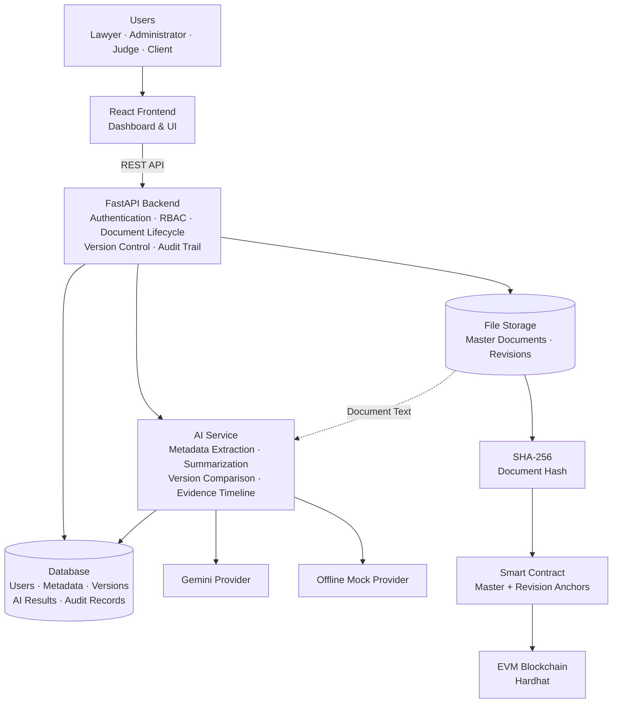

# LegalVault

## AI-Assisted Blockchain eVault for Legal Records

**SIH1284 Prototype**

LegalVault is a secure legal-record custody and intelligence platform designed to manage, verify, analyze, and share legal documents throughout their lifecycle.

It combines **role-based access control, versioned document management, cryptographic integrity verification, blockchain anchoring, and AI-powered legal-document analysis** in a single system.

---

## 🎯 Problem

Legal records need to remain trustworthy throughout their lifecycle. Traditional document storage can make it difficult to:

- Verify whether a document has been modified
- Track different versions of a legal record
- Maintain a reliable provenance history
- Quickly understand large legal documents
- Identify meaningful changes between revisions
- Control access between different stakeholders

---

## 💡 Proposed Solution

LegalVault provides a centralized legal-record vault where documents can be securely stored, versioned, verified, analyzed, and shared.

### 🔐 Trusted Document Custody

- User authentication
- Role-based access control
- Lawyer / Depositor, Administrator, Judge, and Client roles
- Secure document upload and storage
- SHA-256 document hashing
- Blockchain-based integrity anchoring
- Master and revision anchors
- Version history and provenance
- Audit trail
- Controlled document sharing

### 🤖 AI-Powered Legal Intelligence

LegalVault processes each document version independently to provide:

- Automatic metadata extraction
- Legal document summarization
- Evidence timeline generation
- AI-powered version comparison
- Detection of factual, procedural, and legal-claim changes
- Structured extraction of important dates, parties, courts, jurisdiction, and keywords

### 🔄 Version-Aware Processing

Every revision is treated as an independent legal-record version.

```text
Master Document
      │
      ├── V1
      │    ├── Hash
      │    ├── AI Metadata
      │    ├── Summary
      │    └── Evidence Timeline
      │
      ├── V2
      │    ├── Hash
      │    ├── AI Metadata
      │    ├── Summary
      │    └── Evidence Timeline
      │
      └── V3 ...
           │
           └── AI Version Comparison
```

This allows users to understand not only **which version exists**, but also **what changed between versions**.

---

## 🏗️ System Architecture



---

## 🔄 How It Works

```text
Legal Document
      │
      ▼
Secure Upload
      │
      ├──────────────► SHA-256 Hash
      │                     │
      │                     ▼
      │               Smart Contract
      │                     │
      │                     ▼
      │                 Blockchain
      │
      ▼
AI Processing
      │
      ├── Metadata Extraction
      ├── Summarization
      ├── Evidence Timeline
      └── Version Analysis
      │
      ▼
Versioned Legal Record
      │
      ▼
Verification + Audit + Controlled Sharing
```

---

## 🧠 AI Capabilities

### Metadata Extraction

Extracts structured information such as:

- Document type
- Case number
- Court
- Jurisdiction
- Parties
- Important dates
- Subject
- Keywords

### AI Summarization

Generates structured summaries containing:

- Narrative summary
- Key facts
- Legal issues
- Important points

### Evidence Timeline

Identifies and organizes significant legal events, including:

- Filing
- Agreement
- Execution
- Hearing
- Order
- Notice
- Deadline
- Payment
- Transfer
- Amendment

### Version Comparison

Compares document versions in both directions and identifies:

- Metadata changes
- Party changes
- Date changes
- Keyword changes
- Factual or evidentiary changes
- Procedural changes
- Legal claims and grounds
- Material changes

---

## 🔐 Integrity & Verification

LegalVault does **not store the legal document itself on the blockchain**.

Instead:

```text
Legal Document
      │
      ▼
   SHA-256
      │
      ▼
Document Hash
      │
      ▼
Smart Contract
      │
      ▼
EVM Blockchain
```

The blockchain stores the integrity anchor while the actual document remains in controlled storage.

When verification is required, the document can be hashed again and compared against its recorded anchor.

This provides an independent mechanism for detecting document tampering.

---

## 👥 Role-Based Access

LegalVault supports different capabilities for different stakeholders:

| Role | Purpose |
|------|---------|
| Lawyer / Depositor | Upload and manage legal records |
| Administrator | Manage users, records, and system activity |
| Judge | Access authorized legal records and verification information |
| Client | Access records shared with them |

---

## 🧪 Reliability & Validation

The system includes validation and testing across:

- Authentication and RBAC
- Document integrity
- Version isolation
- Multi-user isolation
- Duplicate detection
- Upload validation
- Blockchain verification
- AI metadata extraction
- AI summarization
- AI comparison
- Evidence timeline generation
- Document sharing
- Audit trails
- Timezone handling
- Admin workflows
- Frontend production builds

AI services also support an **offline mock provider** for development and testing when an external AI provider is unavailable.

---

## 🛠️ Tech Stack

### Frontend
- React
- JavaScript
- REST API integration

### Backend
- FastAPI
- Python
- REST APIs

### AI
- Google Gemini
- Modular AI provider architecture
- Offline mock provider

### Blockchain
- EVM-compatible blockchain
- Solidity Smart Contracts
- Hardhat
- SHA-256 hashing

### Data & Storage
- Database-backed metadata and records
- File-based document storage
- Versioned document management

---

## 🚀 Current Status

LegalVault is an **SIH1284 prototype** implementing the core legal-record custody, integrity verification, AI analysis, version management, and administrative workflows.

The system is currently focused on demonstrating an end-to-end working prototype rather than production deployment.

---

## 📌 Key Idea

> **LegalVault combines trusted document custody with AI-powered legal intelligence, allowing legal records to be stored, verified, understood, and compared throughout their lifecycle.**

---
