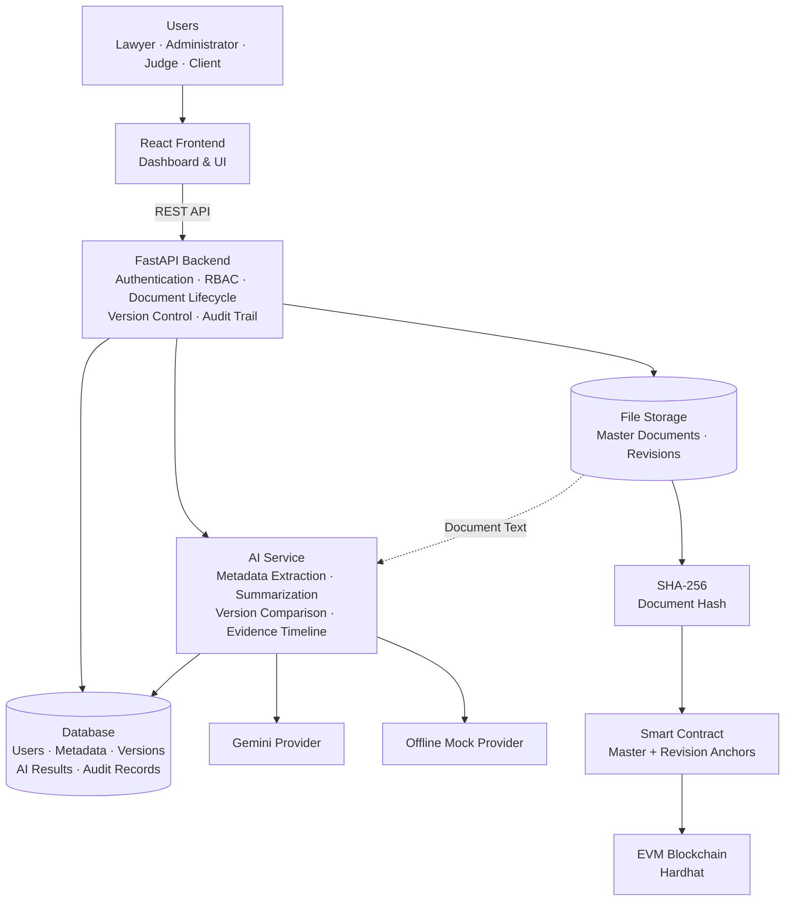

# LegalVault

## AI-Assisted Blockchain eVault for Legal Records

SIH1284 Prototype

LegalVault is a prototype blockchain-based eVault designed to securely manage, verify, and share legal records.

It combines AI-assisted document analysis with blockchain-based integrity verification.

## Problem

Legal records need to be:
- Secure
- Accessible to authorized stakeholders
- Resistant to tampering
- Easy to verify
- Traceable through their lifecycle

## Proposed Solution

LegalVault provides:

- Secure document storage
- AI-assisted document analysis
- Blockchain-based document integrity verification
- Role-based access
- Controlled document sharing
- Version tracking
- AI-assisted version comparison

## Architecture

## 🏗️ System Architecture

